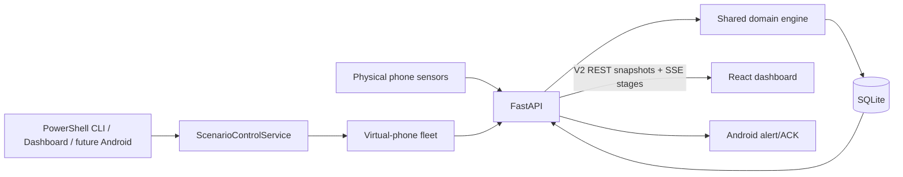
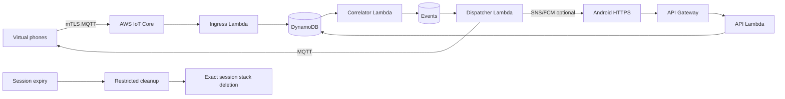
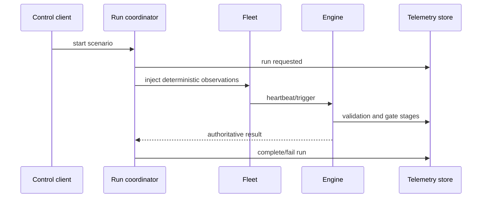
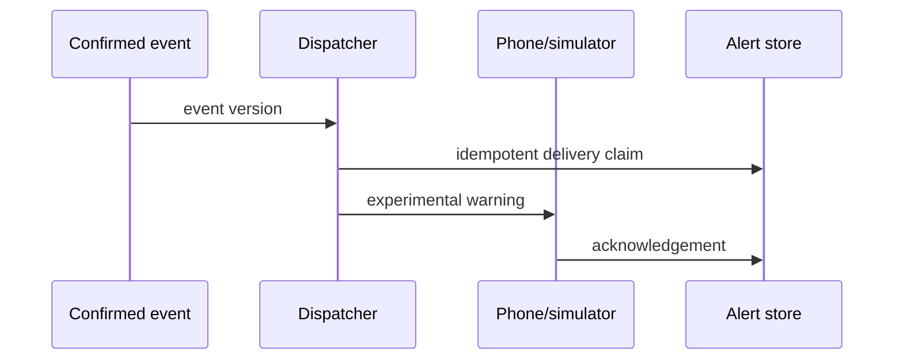

# QuakeMesh V2 architecture

## Domain boundaries

- **Observation:** device-reported heartbeat or motion features.
- **Evidence:** a validated, motion-gated, H3-canonicalized trigger.
- **Evaluation truth:** simulator-only labels and expected results; never accepted by ingestion.
- **Event:** authoritative server-side corroboration state.
- **Alert delivery:** target and transport outcome, separate from event truth.
- **Scenario run:** controlled experiment metadata and stage telemetry. Scenario events retain the run ID.
- **Cloud session:** owned infrastructure metadata and expiry, separate from application state.

## Local

## AWS

## Scenario and alert sequences

Local and AWS adapters must implement the same public schemas; storage and transport details may differ.

Local correlation is partitioned by `(provenance_type, scenario_run_id)`. Physical records use `physical` plus a null run ID; every controlled run uses `scenario` plus its run ID. The same partition applies to active-event merging and alert targeting. SQLite `BEGIN IMMEDIATE` makes the one-active-run policy atomic.

The current local runner has no safe interruption primitive, so the public contract intentionally omits cancellation rather than presenting a non-functional control.
