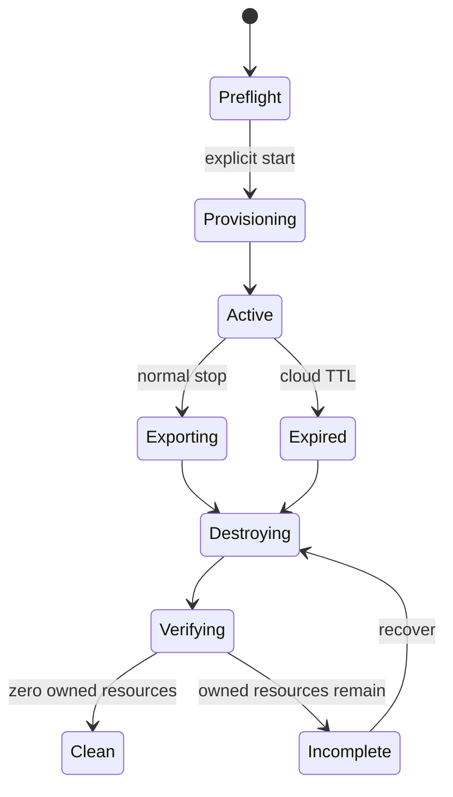

# AWS ephemeral lifecycle

## Identity and ownership

Session IDs use `qm-<UTC yyyyMMdd-HHmmss>-<4 hex>`. The exact session ID, stack ARN/name, account, region, expiry timestamp, and mode are stored in the ignored runtime configuration without long-lived credentials. Taggable stack resources carry `Project=QuakeMesh`, `Architecture=V2`, `Environment=AcademicDemo`, `Ephemeral=true`, `SessionId`, and `ExpiresAt`.

## State machine

`deploy.ps1` validates STS identity and refuses an existing conflicting stack. TTL is 60–240 minutes, default 120. A one-time EventBridge Scheduler target invokes a cleanup Lambda that selects simulator Things by exact session attribute and name prefix, refuses shared certificates or unexpected policies, deletes only verified session credentials, and then requests deletion of its own exact stack. Normal `destroy.ps1` performs the same exact-prefix IoT cleanup, deletes the exact stack, and verifies owned resources are absent.

All four DynamoDB tables, managed log groups, schedules, and Lambda layers use stack deletion semantics. The V2 stack creates no retained S3 bucket; CDK deployment assets and shared bootstrap resources are account prerequisites outside session ownership. Account-level budgets are also outside session teardown.

Cleanup reports use `CLEAN` or `INCOMPLETE`; API errors and access-denied results are not interpreted as absence. Automatic cleanup is a backstop and does not replace a post-demo `destroy.ps1` run plus `CLEAN` verification.
