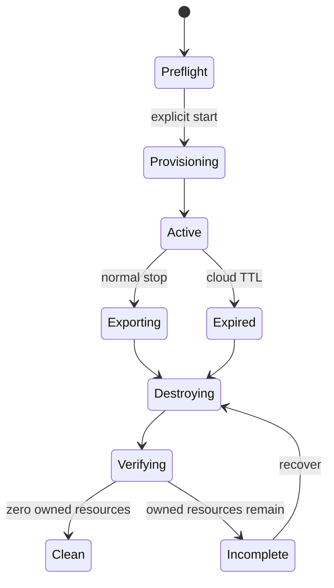

# AWS ephemeral lifecycle

## Identity and ownership

Session IDs use `QM-<UTC yyyyMMdd-HHmmss>-<4 hex>`. The exact session ID, stack ARN/name, account, region, created/expiry timestamps, and mode are stored locally without credentials. Taggable resources carry `Project=QuakeMesh`, `Environment=AcademicDemo`, `Ephemeral=true`, `SessionId`, `CreatedAt`, and `ExpiresAt`.

## State machine

`session_start` validates STS identity and refuses an unknown conflicting session. TTL is 60–240 minutes, default 120. A one-time EventBridge Scheduler target may delete only the exact session stack and explicitly recorded out-of-stack IoT principals. Normal stop disables/deletes certificates, exports evidence, deletes the stack, removes dedicated deployment assets when ownership is proven, and verifies each service.

Strict mode sets session S3, DynamoDB, managed log groups, schedules, and other session storage to `DESTROY`; S3 uses automatic object deletion. Account-level budgets and shared CDK bootstrap resources are outside session teardown. A dedicated qualifier/bootstrap may be removed only when metadata proves exclusive QuakeMesh ownership.

Cleanup reports use `CLEAN` or `INCOMPLETE`; API errors and access-denied results are not interpreted as absence.
